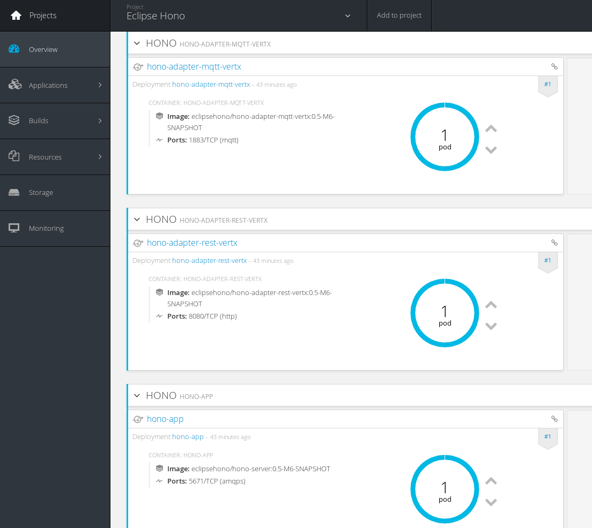

# Eclipse Hono on EnMasse

Playgroud for running [Eclipse Hono](https://www.eclipse.org/hono) on [EnMasse](https://github.com/EnMasseProject/enmasse).

## Prerequisites

The main prerequisite is to have a running OpenShift cluster. In order to have a simple one node cluster on
a local development PC, this [guide](https://github.com/openshift/origin/blob/master/docs/cluster_up_down.md)
on using _oc_ tools is pretty useful.

## Deploying EnMasse

The EnMasse project can be deployed on a running OpenShift cluster using just the following provided script :

        enmasse_deploy.sh
        

Or the TLS version if you want to enable clients connecting using TLS protocol :

        enmasse_tls_deploy.sh

## Deploying Eclipse Hono

After deploying EnMasse, all the Eclipse Hono components can be deployed with the following provided script :

        hono_deploy.sh

It will deploy the Hono Server and the two available protocol adapters (HTTP REST and MQTT).

## Deploying addresses

In order to make the messaging infrastructure aware of the _telemetry_ and _event_ channels handled by the Eclipse Hono API,
we could deploy them through the EnMasse addresses API :

        curl -X PUT -H "content-type: application/json" --data-binary @addresses.json http://$(oc get service -o jsonpath='{.spec.clusterIP}' address-controller):8080/v3/address

## Receiver

An example of receiver application is provided by the Eclipse Hono GitHub repo and how to run it is described
on the official website in the [Getting Started guide](https://www.eclipse.org/hono/getting-started/).

Before doing that, it's needed to create a new "user" using the EnMasse console (i.e. user1@enmasse).

After that, the receiver console application can be launched in the following way :

        mvn spring-boot:run -Drun.arguments=--hono.client.host=172.30.90.42,--hono.client.port=5672,--hono.client.trustStorePath=null,--hono.client.username=user1@enmasse,--hono.client.password=pw
        
Where the address is related to the _messaging_ router service cluster IP provided by EnMasse.
In the following picture, a receiver running and receiving published messages :

## Sender

The sender can be the one provided as example from the Eclipse Hono GitHub repo, an HTTP client or an MQTT client using
related protocol adapters.
As the receiver one, the sender console application can be launched in the following way :

        mvn spring-boot:run -Drun.arguments=--spring.profiles.active=sender,--hono.client.host=172.30.35.38

Where the address is related to the _hono-app_ service cluster IP so the Hono server component.

Regarding the protocol adapters, their usage is explained here :

* [HTTP REST](https://www.eclipse.org/hono/component/rest-adapter/) adapter
* [MQTT](https://www.eclipse.org/hono/component/mqtt-adapter/) adapter

In both cases, the sender starts to work after a device registration that is possible using the HTTP REST API but not
the MQTT one in the following way :

        curl -X POST -i -d 'device_id=4711' http://172.30.121.77:8080/registration/DEFAULT_TENANT

Where the address is related to the _hono-adapter-rest-vertx_ service cluster IP.
After registering the device, sending data is possible through HTTP REST :

        curl -X PUT -i -H 'Content-Type: application/json' --data-binary '{"temp": 5}' http://172.30.121.77:8080/telemetry/DEFAULT_TENANT/4711

Or using MQTT :

        mosquitto_pub -h 172.30.19.182 -i 4711 -t telemetry/DEFAULT_TENANT/4711 -m '{"temp": 5}'

Where the address is related to the _hono-adapter-mqtt-vertx_ service cluster IP.

## Current limitations

The current deployment has the following "limitations" :

* there are no _policies_ configured into the messaging router (as provided in the official Eclipse Hono example)
* there is no _encrypted_ communication between the Hono server component and the messaging router infrastructure 

The above "limitations" will be addressed in the next cycle.